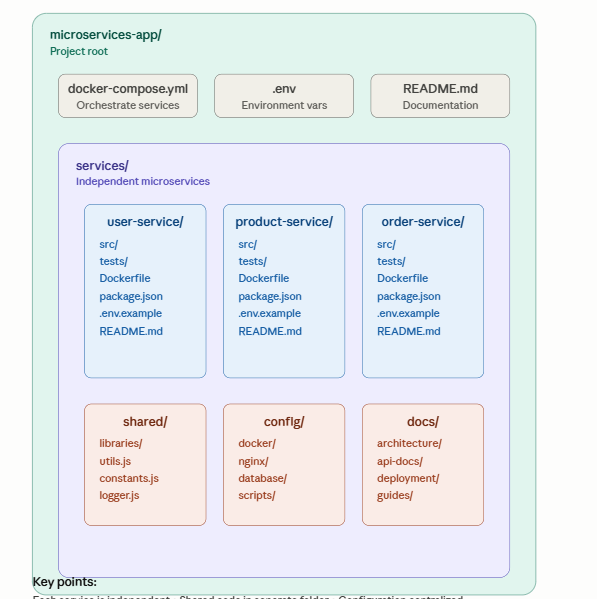

# Overview of Microservices Architectures - Why It's Good Design

## What Makes Microservices a Good Design?

Microservices follows **SOLID principles** and modern software design patterns, making it a strong architectural choice.

---

## Core Design Principles

### 1. **Single Responsibility Principle (SRP)**
- Each microservice has ONE job
- Makes code easier to understand and maintain
- Example: Payment Service only handles payments, nothing else

### 2. **Loose Coupling**
- Services are independent
- Change in one service doesn't break others
- Communication happens via APIs, not shared code
- Example: If User Service changes, Order Service still works fine

### 3. **High Cohesion**
- Related functionality grouped together
- Each service is focused and organized
- Example: All payment logic stays in Payment Service

### 4. **Scalability**
- Scale individual services based on demand
- Example: During sale season, scale Order Service without touching User Service

---

## Design Benefits

| Benefit | Why It's Good |
|---------|--------------|
| **Flexibility** | Use different tech for different services |
| **Resilience** | One service failure ≠ entire system down |
| **Agility** | Teams work independently, faster deployment |
| **Maintainability** | Smaller codebases = easier to debug |
| **Team Autonomy** | Different teams own different services |

---

## Real-Time Example: Netflix

Netflix uses microservices because:
- ✅ Scale video streaming independently
- ✅ Update recommendation engine without affecting playback
- ✅ Deploy new features multiple times per day
- ✅ Multiple teams work in parallel

---

## Why It's Better Than Monolithic

| Aspect | Monolith | Microservices |
|--------|----------|---------------|
| **Scaling** | Scale entire app | Scale specific service |
| **Deployment** | Deploy everything | Deploy one service |
| **Tech Stack** | One technology | Multiple technologies |
| **Failure** | One bug crashes app | Isolated failure |
| **Team Speed** | Dependencies slow teams | Independent teams move fast |

